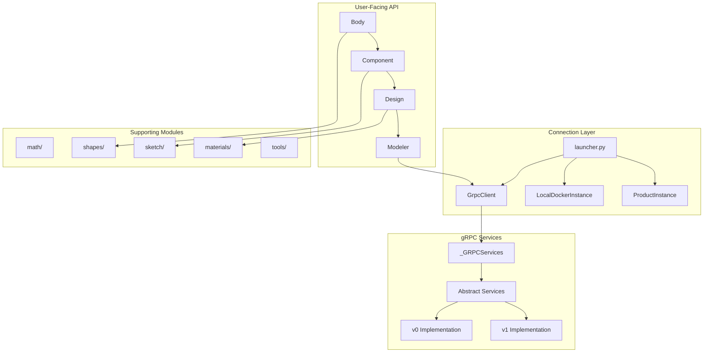

# PyAnsys Geometry Developer Documentation

## Overview

This directory contains internal developer documentation for the `ansys-geometry-core` library. These documents explain the codebase architecture, design patterns, and implementation details to help developers understand, contribute to, and extend the library.

## Target Audience

- Developers contributing to the library
- Engineers extending functionality
- Integrators building upon the library

## Documentation Index

### Architecture Documentation

| Document | Description |
|----------|-------------|
| [gRPC Layer Architecture](./grpc-layer-architecture.md) | Proto-agnostic gRPC services layer, version mediator pattern, and service implementations |
| [Connection Module](./connection-module.md) | Backend connection management, launchers, and client instantiation |
| [Designer Module](./designer-module.md) | High-level design API for modeling operations |
| [Error Handling](./error-handling.md) | gRPC error protection patterns and custom exceptions |

## Module Overview



## Key Concepts

### Proto Version Agnosticism

The library supports multiple gRPC API versions (v0, v1) through an abstraction layer. Application code never interacts directly with proto messages—all communication goes through abstract service interfaces that return Python dictionaries.

### Lazy Loading

Services and connections are lazily initialized to minimize startup overhead. The `_GRPCServices` mediator instantiates version-specific services only when first accessed.

### Backend Flexibility

The library supports multiple backend types:
- **Geometry Service** (Windows/Linux, Core/DMS)
- **Discovery** (with or without headless mode)
- **SpaceClaim**

Connections can be established via:
- Direct host/port configuration
- Docker containers
- Local product instances
- PyPIM remote instances

## Getting Started

To understand the codebase, start with these documents in order:

1. **[Connection Module](./connection-module.md)** - Understand how connections are established
2. **[gRPC Layer Architecture](./grpc-layer-architecture.md)** - Learn the service abstraction layer
3. **[Designer Module](./designer-module.md)** - Explore the modeling API hierarchy
4. **[Error Handling](./error-handling.md)** - Understand error protection patterns

## Source Code Structure

```
src/ansys/geometry/core/
├── connection/          # Backend connection management
│   ├── client.py        # GrpcClient class
│   ├── launcher.py      # launch_modeler functions
│   ├── backend.py       # BackendType enum
│   ├── docker_instance.py
│   └── product_instance.py
├── designer/            # Design modeling API
│   ├── design.py        # Design class (root component)
│   ├── component.py     # Component class (assembly nodes)
│   ├── body.py          # Body class (solid/surface geometry)
│   ├── face.py, edge.py, vertex.py
│   └── ...
├── _grpc/               # gRPC services layer
│   ├── _services/       # Service implementations
│   │   ├── base/        # Abstract service interfaces
│   │   ├── v0/          # v0 proto implementations
│   │   └── v1/          # v1 proto implementations
│   └── _version.py      # Version detection
├── math/                # Mathematical primitives
├── shapes/              # Geometric shape definitions
├── sketch/              # 2D sketching operations
├── materials/           # Material definitions
├── tools/               # Measurement, repair, prepare tools
├── modeler.py           # Main Modeler class
└── errors.py            # Custom exceptions
```

## Contributing

When contributing documentation:

1. **Verify claims** - Read source files before documenting
2. **Include diagrams** - Use Mermaid for architecture visualization
3. **Stay current** - Update docs when implementation changes
4. **Use consistent terminology** - Match the codebase naming conventions
