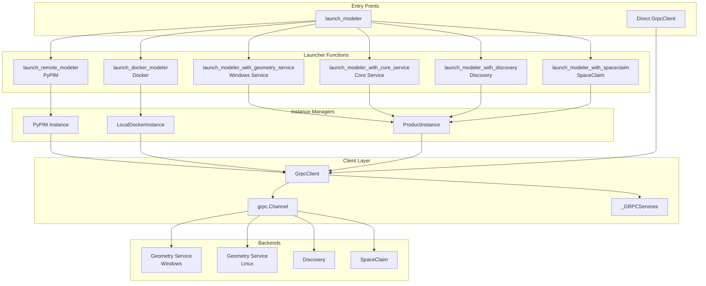
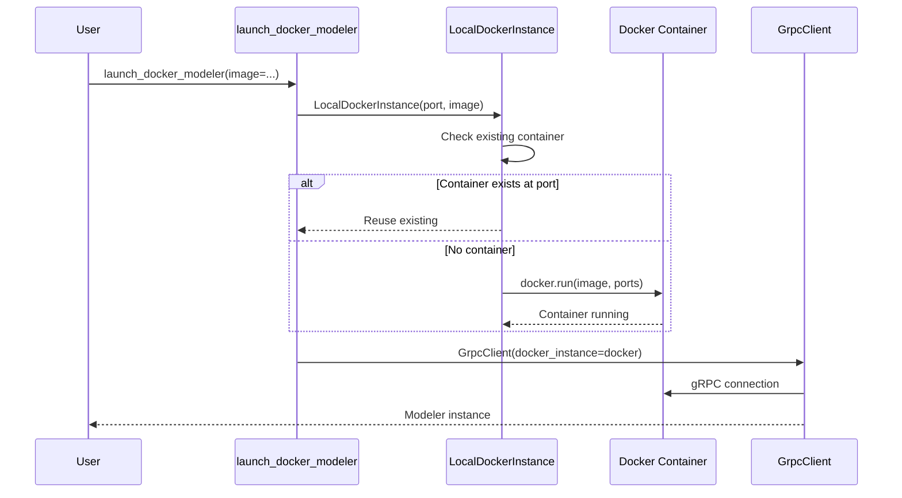
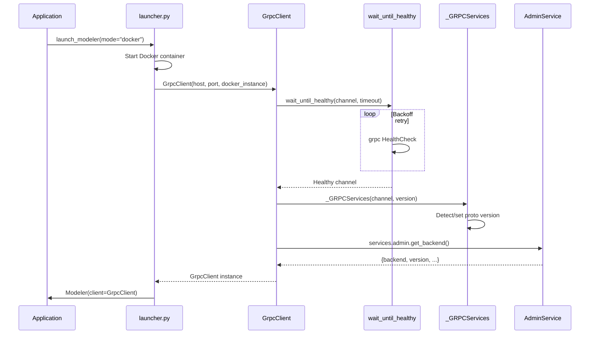

# Connection Module

## Overview

The connection module (`src/ansys/geometry/core/connection/`) manages all aspects of establishing and maintaining connections to Ansys Geometry backends. It provides a unified interface for connecting to various backend types through multiple deployment scenarios.

## Architecture Diagram



## Key Components

### 1. GrpcClient

**Location**: [connection/client.py](../../src/ansys/geometry/core/connection/client.py)

The `GrpcClient` class wraps the gRPC connection and provides:

- Channel creation and health checking
- Service access through `_GRPCServices`
- Backend type and version detection
- Lifecycle management (close/cleanup)

```python
class GrpcClient:
    def __init__(
        self,
        host: str = DEFAULT_HOST,
        port: str | int = DEFAULT_PORT,
        channel: grpc.Channel | None = None,
        remote_instance: Instance | None = None,
        docker_instance: LocalDockerInstance | None = None,
        product_instance: ProductInstance | None = None,
        timeout: Real = 120,
        proto_version: str | None = None,
        transport_mode: str | None = None,
        # ...
    ):
        # Wait for channel to be healthy
        self._channel = wait_until_healthy(channel, timeout, ...)
        
        # Initialize gRPC services mediator
        self._services = _GRPCServices(self._channel, version=proto_version)
        
        # Retrieve backend information
        response = self._services.admin.get_backend()
        self._backend_type = response.get("backend")
        self._backend_version = response.get("version")
```

**Key Properties**:

| Property | Type | Description |
|----------|------|-------------|
| `backend_type` | `BackendType` | Type of connected backend |
| `backend_version` | `semver.Version` | Backend software version |
| `channel` | `grpc.Channel` | Underlying gRPC channel |
| `services` | `_GRPCServices` | Access to all gRPC service stubs |
| `healthy` | `bool` | Connection health status |

---

### 2. Launcher Functions

**Location**: [connection/launcher.py](../../src/ansys/geometry/core/connection/launcher.py)

The launcher module provides factory functions for creating `Modeler` instances with different backends.

#### Main Entry Point

```python
def launch_modeler(mode: str = None, **kwargs) -> Modeler:
    """Start the Modeler interface for PyAnsys Geometry.
    
    Parameters
    ----------
    mode : str
        Launch mode: "pypim", "docker", "geometry_service", 
        "core_service", "spaceclaim", "discovery"
    """
```

#### Available Launchers

| Function | Backend | Description |
|----------|---------|-------------|
| `launch_remote_modeler` | PyPIM | Remote service via Ansys Platform Instance Management |
| `launch_docker_modeler` | Docker | Local Docker container |
| `launch_modeler_with_geometry_service` | DMS | Windows Geometry Service (legacy) |
| `launch_modeler_with_core_service` | Core | Core Geometry Service |
| `launch_modeler_with_discovery` | Discovery | Ansys Discovery with API server |
| `launch_modeler_with_spaceclaim` | SpaceClaim | Ansys SpaceClaim with API server |

---

### 3. BackendType Enum

**Location**: [connection/backend.py](../../src/ansys/geometry/core/connection/backend.py)

Defines the supported backend types:

```python
class BackendType(Enum):
    DISCOVERY = 0
    SPACECLAIM = 1
    WINDOWS_SERVICE = 2
    LINUX_SERVICE = 3
    CORE_WINDOWS = 4
    CORE_LINUX = 5
    DISCOVERY_HEADLESS = 6
```

**Utility Methods**:

```python
BackendType.is_core_service(backend_type)  # True for Core Service backends
BackendType.is_headless_service(backend_type)  # True for headless backends
BackendType.is_linux_service(backend_type)  # True for Linux backends
BackendType.is_windows_service(backend_type)  # True for Windows backends
```

---

### 4. LocalDockerInstance

**Location**: [connection/docker_instance.py](../../src/ansys/geometry/core/connection/docker_instance.py)

Manages local Docker container lifecycle for the Geometry Service.



**Available Containers** (`GeometryContainers` enum):

| Container | Platform | Description |
|-----------|----------|-------------|
| `CORE_WINDOWS_LATEST` | Windows | Latest Core Service (Windows) |
| `CORE_LINUX_LATEST` | Linux | Latest Core Service (Linux) |
| `CORE_WINDOWS_27_1` | Windows | Core Service 27.1 |
| `CORE_LINUX_27_1` | Linux | Core Service 27.1 |

---

### 5. ProductInstance

**Location**: [connection/product_instance.py](../../src/ansys/geometry/core/connection/product_instance.py)

Manages local product (Discovery/SpaceClaim) process lifecycle.

```python
class ProductInstance:
    """Manages a locally running Ansys product with the API server add-in."""
    
    def __init__(self, process: subprocess.Popen):
        self._process = process
    
    def close(self):
        """Terminate the product process."""
        self._process.terminate()
```

**Product Paths** (constants):

| Constant | Value | Description |
|----------|-------|-------------|
| `GEOMETRY_SERVICE_EXE` | `Presentation.ApiServerDMS.exe` | Windows Service executable |
| `CORE_GEOMETRY_SERVICE_EXE` | `Presentation.ApiServerCoreService.exe` | Core Service executable |
| `DISCOVERY_EXE` | `Discovery.exe` | Discovery executable |
| `SPACECLAIM_EXE` | `SpaceClaim.exe` | SpaceClaim executable |

---

## Transport Modes

The connection module supports multiple transport modes via `ansys-tools-common-cyberchannel`:

| Mode | Description | Use Case |
|------|-------------|----------|
| `insecure` | Plain HTTP/2 | Development, local testing |
| `uds` | Unix Domain Sockets | Same-machine performance |
| `wnua` | Windows Named User Authentication | Windows enterprise |
| `mtls` | Mutual TLS | Secure production |

```python
# Example: Connect with UDS
modeler = launch_modeler(
    mode="core_service",
    transport_mode="uds",
    uds_id="my-session"
)
```

---

## Connection Flow



---

## Health Checking

The `wait_until_healthy()` function implements exponential backoff:

```python
def wait_until_healthy(channel, timeout):
    """Wait for channel to become healthy.
    
    Backoff strategy:
    - Start with 0.1 second timeout
    - Double on each failure
    - Cap at remaining time
    - Raise TimeoutError if total time exceeds timeout
    """
```

---

## Related Documentation

- [gRPC Layer Architecture](./grpc-layer-architecture.md) - Service abstraction layer
- [Designer Module](./designer-module.md) - Using the Modeler and Design APIs
- [Error Handling](./error-handling.md) - Connection error handling
