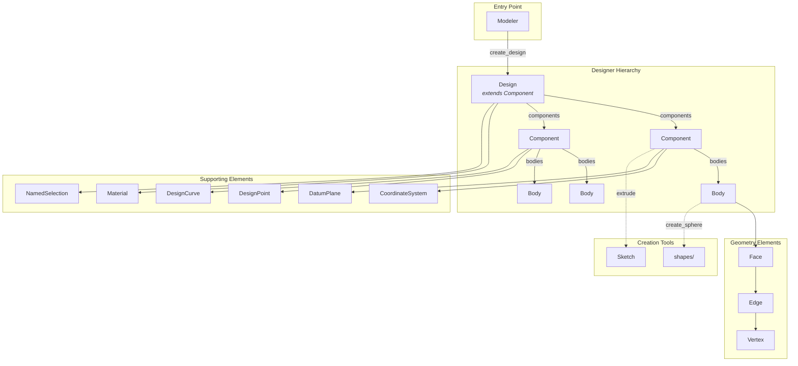
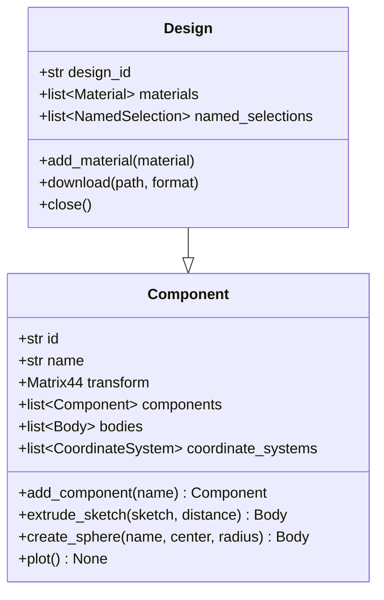
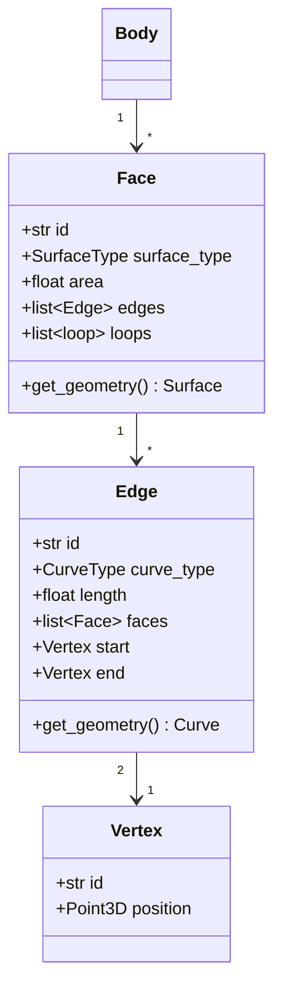
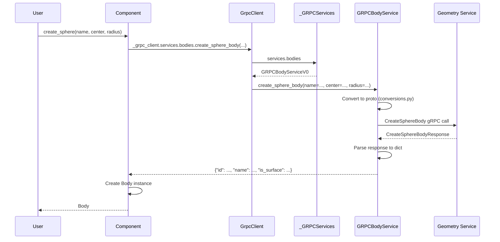
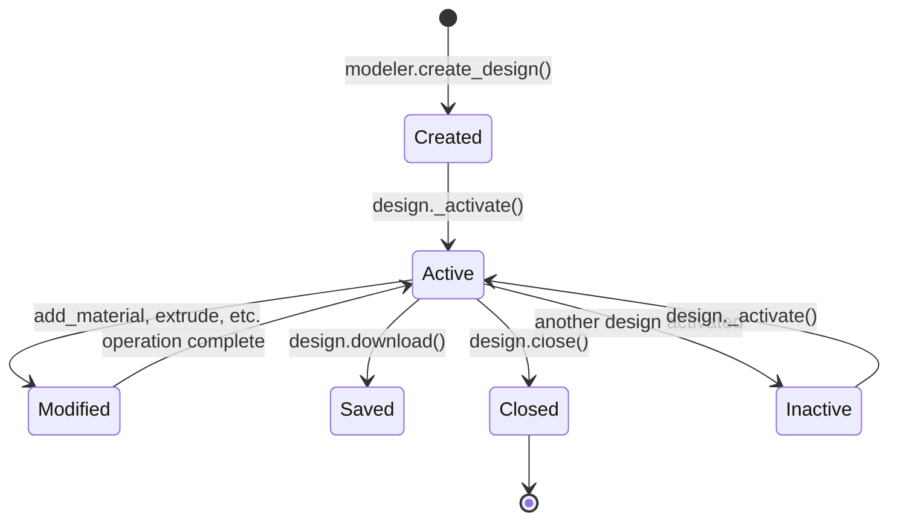

# Designer Module

## Overview

The designer module (`src/ansys/geometry/core/designer/`) provides the high-level API for creating and manipulating geometry designs. It implements an assembly hierarchy pattern where `Design` is the root, containing `Component` nodes that hold `Body` geometry.

## Architecture Diagram



## Key Classes

### 1. Modeler

**Location**: [modeler.py](../../src/ansys/geometry/core/modeler.py)

The `Modeler` class is the main entry point for interacting with the Geometry service.

```python
class Modeler:
    """Provides for interacting with an open session of the Geometry service."""
    
    def __init__(
        self,
        host: str = DEFAULT_HOST,
        port: str | int = DEFAULT_PORT,
        channel: Channel | None = None,
        # ... instance parameters
    ):
        self._client = GrpcClient(...)
        self._designs: list[Design] = []
```

**Key Methods**:

| Method | Description |
|--------|-------------|
| `create_design(name)` | Create a new design |
| `open_file(file_path)` | Open an existing design file |
| `read_existing_design()` | Read design from active session |
| `close()` | Close connection and cleanup |

**Tools Access**:

```python
modeler.measurement_tools  # MeasurementTools instance
modeler.repair_tools       # RepairTools instance
modeler.prepare_tools      # PrepareTools instance
modeler.geometry_commands  # GeometryCommands instance
```

---

### 2. Design

**Location**: [designer/design.py](../../src/ansys/geometry/core/designer/design.py)

The `Design` class extends `Component` and represents the root of a geometry assembly.

```python
class Design(Component):
    """Provides for organizing geometry assemblies.
    
    This class synchronizes to a supporting Geometry service instance.
    """
    
    def __init__(self, name: str, modeler: Modeler, read_existing_design: bool = False):
        super().__init__(name, None, modeler.client)
        
        # Create design on server
        response = self._grpc_client.services.designs.new(name=name)
        self._design_id = response.get("design_id")
        self._id = response.get("main_part_id")
```

**Design-Specific Properties**:

| Property | Type | Description |
|----------|------|-------------|
| `design_id` | `str` | Unique design identifier |
| `materials` | `list[Material]` | Available materials |
| `named_selections` | `list[NamedSelection]` | Named selection groups |
| `beam_profiles` | `list[BeamProfile]` | Available beam profiles |
| `parameters` | `list[Parameter]` | Design parameters |
| `is_active` | `bool` | Whether design is currently active |

**Key Methods**:

```python
design.add_material(material)      # Add material to design
design.remove_material(material)   # Remove material (26R1+)
design.download(file_path, format) # Download design file
design.close()                     # Close the design
```

**Export Formats** (`DesignFileFormat` enum):

| Format | Extension | Description |
|--------|-----------|-------------|
| `SCDOCX` | `.scdocx` | SpaceClaim native format |
| `PARASOLID_TEXT` | `.x_t` | Parasolid text format |
| `PARASOLID_BIN` | `.x_b` | Parasolid binary format |
| `FMD` | `.fmd` | Ansys Mechanical format |
| `STEP` | `.stp` | STEP standard format |
| `IGES` | `.igs` | IGES format |
| `PMDB` | `.pmdb` | Ansys DesignModeler format |

---

### 3. Component

**Location**: [designer/component.py](../../src/ansys/geometry/core/designer/component.py)

The `Component` class represents a node in the assembly hierarchy, containing bodies and child components.



**Hierarchy Access**:

```python
component.components      # Child components
component.bodies          # Bodies in this component
component.all_bodies      # Bodies in entire subtree
component.part            # Associated Part
component.parent          # Parent component
```

**Body Creation Methods**:

| Method | Description |
|--------|-------------|
| `extrude_sketch(sketch, distance)` | Extrude a 2D sketch |
| `sweep_sketch(sketch, path)` | Sweep sketch along path |
| `revolve_sketch(sketch, axis, angle)` | Revolve sketch around axis |
| `create_sphere(name, center, radius)` | Create sphere body |
| `create_body_from_surface(surface)` | Create surface body |

**Shared Topology** (`SharedTopologyType` enum):

```python
class SharedTopologyType(Enum):
    SHARETYPE_NONE = 0    # No sharing
    SHARETYPE_SHARE = 1   # Share topology
    SHARETYPE_MERGE = 2   # Merge topology
    SHARETYPE_GROUPS = 3  # Group sharing
```

---

### 4. Body

**Location**: [designer/body.py](../../src/ansys/geometry/core/designer/body.py)

The `Body` class represents solid or surface geometry.

```python
class Body:
    """Represents a solid or surface body."""
    
    @property
    def faces(self) -> list[Face]:
        """All faces of the body."""
        
    @property
    def edges(self) -> list[Edge]:
        """All edges of the body."""
        
    @property
    def volume(self) -> Quantity:
        """Body volume (solids only)."""
        
    @property
    def is_surface(self) -> bool:
        """Whether this is a surface body."""
```

**Key Methods**:

| Method | Description |
|--------|-------------|
| `copy(parent, name)` | Copy body to another component |
| `translate(direction, distance)` | Translate body |
| `rotate(axis, angle)` | Rotate body |
| `scale(factor)` | Scale body |
| `tessellate(options)` | Get tessellation mesh |
| `plot()` | Visualize body |

---

### 5. Face, Edge, Vertex

**Locations**: 
- [designer/face.py](../../src/ansys/geometry/core/designer/face.py)
- [designer/edge.py](../../src/ansys/geometry/core/designer/edge.py)
- [designer/vertex.py](../../src/ansys/geometry/core/designer/vertex.py)



**Surface Types** (`SurfaceType` enum):

| Type | Description |
|------|-------------|
| `SURFACETYPE_PLANE` | Planar surface |
| `SURFACETYPE_CYLINDER` | Cylindrical surface |
| `SURFACETYPE_CONE` | Conical surface |
| `SURFACETYPE_SPHERE` | Spherical surface |
| `SURFACETYPE_TORUS` | Toroidal surface |
| `SURFACETYPE_UNKNOWN` | General NURBS surface |

**Curve Types** (`CurveType` enum):

| Type | Description |
|------|-------------|
| `CURVETYPE_LINE` | Straight line |
| `CURVETYPE_CIRCLE` | Circular arc |
| `CURVETYPE_ELLIPSE` | Elliptical arc |
| `CURVETYPE_UNKNOWN` | General NURBS curve |

---

## Data Flow: Creating a Body



---

## Design Lifecycle



**Important**: Only one design can be active at a time. Creating a new design or activating an existing one deactivates others.

---

## Supporting Elements

### CoordinateSystem

Defines local coordinate frames within components:

```python
coord_sys = component.create_coordinate_system(
    name="MyCS",
    frame=Frame(origin, dir_x, dir_y)
)
```

### DatumPlane

Reference planes for sketching:

```python
datum = component.create_datum_plane(
    name="MyPlane",
    plane=Plane(origin, direction)
)
```

### NamedSelection

Groups of geometry elements for analysis:

```python
selection = design.create_named_selection(
    name="LoadFaces",
    faces=[face1, face2, face3]
)
```

### Material

Material definitions for bodies:

```python
material = Material(
    name="Steel",
    density=Quantity(7850, "kg/m^3"),
    # ... properties
)
design.add_material(material)
body.assign_material(material)
```

---

## Design Decorators

The designer module uses several decorators for method protection:

| Decorator | Purpose |
|-----------|---------|
| `@check_input_types` | Validate parameter types |
| `@ensure_design_is_active` | Verify design is active before operation |
| `@min_backend_version(major, minor, patch)` | Require minimum backend version |
| `@graphics_required` | Require graphics capability (plotting) |
| `@deprecated_method(...)` | Mark method as deprecated |

---

## Related Documentation

- [gRPC Layer Architecture](./grpc-layer-architecture.md) - Underlying service layer
- [Connection Module](./connection-module.md) - Establishing connections
- [Error Handling](./error-handling.md) - Error protection patterns
