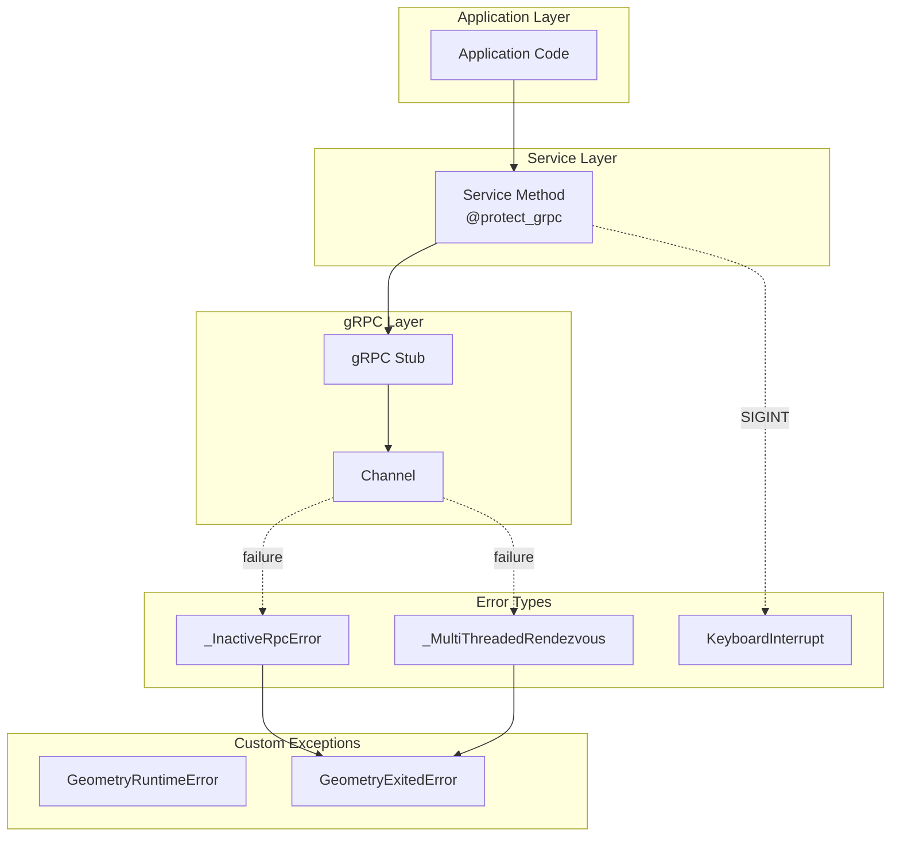
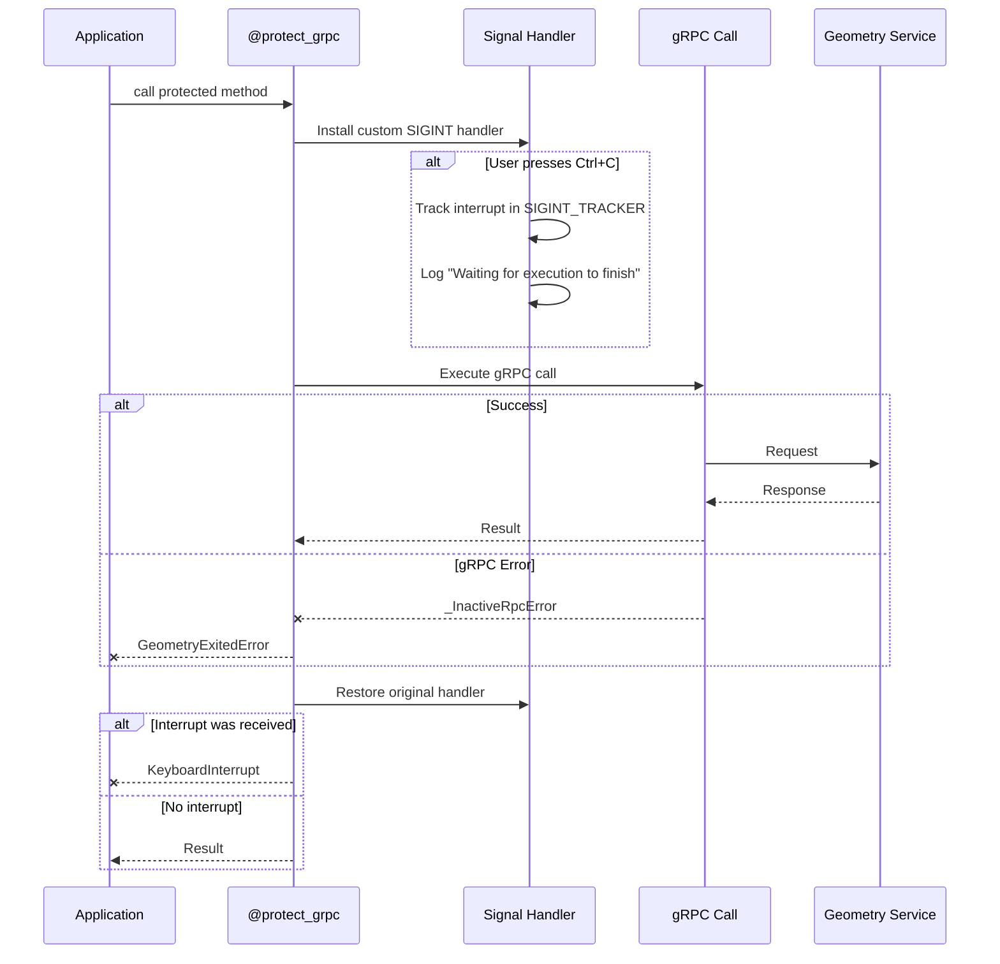

# Error Handling

## Overview

The error handling module (`src/ansys/geometry/core/errors.py`) provides custom exceptions and a decorator pattern for protecting gRPC calls from common failure modes. The primary mechanism is the `@protect_grpc` decorator, which wraps gRPC operations to provide consistent error handling and interrupt protection.

## Architecture Diagram



## Custom Exceptions

### GeometryRuntimeError

**Purpose**: Wraps runtime errors from the Geometry service.

```python
class GeometryRuntimeError(RuntimeError):
    """Provides error message when Geometry service passes a runtime error."""
    pass
```

**Usage**: Raised when the Geometry service returns a business logic error (invalid operation, unsupported feature, etc.).

### GeometryExitedError

**Purpose**: Indicates the Geometry service connection has been lost.

```python
class GeometryExitedError(RuntimeError):
    """Provides error message to raise when Geometry service has exited.
    
    Parameters
    ----------
    msg : str, default: "Geometry service has exited."
        Message to raise.
    """
    
    def __init__(self, msg="Geometry service has exited."):
        RuntimeError.__init__(self, msg)
```

**Usage**: Raised by `@protect_grpc` when the underlying gRPC channel fails.

---

## The `@protect_grpc` Decorator

**Location**: [errors.py](../../src/ansys/geometry/core/errors.py)

The `@protect_grpc` decorator provides two key protections:

1. **gRPC Exception Capture**: Converts low-level gRPC errors to meaningful exceptions
2. **KeyboardInterrupt Protection**: Prevents Ctrl+C from crashing the Geometry service

### Implementation

```python
def protect_grpc(func: _F) -> _F:
    """Capture gRPC exceptions and raise a more succinct error message.
    
    This method captures the KeyboardInterrupt exception to avoid
    segfaulting the Geometry service.
    """
    
    @wraps(func)
    def wrapper(*args, **kwargs):
        # Install custom SIGINT handler on main thread
        old_handler = None
        if threading.current_thread().__class__.__name__ == "_MainThread":
            if threading.current_thread().is_alive():
                old_handler = signal.signal(signal.SIGINT, handler)
        
        # Execute the wrapped function
        try:
            out = func(*args, **kwargs)
        except (_InactiveRpcError, _MultiThreadedRendezvous) as error:
            raise GeometryExitedError(
                f"Geometry service connection terminated: {error.details()}"
            ) from None
        
        # Restore original handler and check for deferred interrupt
        if threading.current_thread().__class__.__name__ == "_MainThread":
            received_interrupt = bool(SIGINT_TRACKER)
            SIGINT_TRACKER.clear()
            if old_handler:
                signal.signal(signal.SIGINT, old_handler)
            if received_interrupt:
                raise KeyboardInterrupt("Interrupted during Geometry service execution")
        
        return out
    
    return wrapper
```

### Flow Diagram



---

## Usage Pattern

Every gRPC service method should be decorated with `@protect_grpc`:

```python
class GRPCBodyServiceV0(GRPCBodyService):
    """Body service for v0 of the Geometry API."""
    
    @protect_grpc
    def __init__(self, channel: grpc.Channel):
        from ansys.api.geometry.v0.bodies_pb2_grpc import BodiesStub
        self._stub = BodiesStub(channel)
    
    @protect_grpc
    def create_sphere_body(self, **kwargs) -> dict:
        """Create a sphere body on the server."""
        from ansys.api.geometry.v0.bodies_pb2 import CreateSphereBodyRequest
        
        request = CreateSphereBodyRequest(...)
        response = self._stub.CreateSphereBody(request)
        return {"id": response.id, ...}
```

---

## SIGINT Handling Details

### The Problem

When Python receives SIGINT (Ctrl+C) during a gRPC call, the default behavior can:
- Interrupt the gRPC channel mid-operation
- Leave the Geometry service in an inconsistent state
- Cause segmentation faults in native code

### The Solution

The `@protect_grpc` decorator:

1. **Installs a custom signal handler** before each gRPC call
2. **Logs the interrupt** but allows the gRPC call to complete
3. **Restores the original handler** after the call
4. **Raises KeyboardInterrupt** if one was received during execution

```python
# Global tracker for deferred interrupts
SIGINT_TRACKER = []

def handler(sig, frame):
    """Pass signal to the custom interrupt handler."""
    LOG.info("KeyboardInterrupt received. Waiting until Geometry service execution finishes.")
    SIGINT_TRACKER.append(True)
```

### Thread Safety

The signal handler is only installed on the main thread:

```python
if threading.current_thread().__class__.__name__ == "_MainThread":
    if threading.current_thread().is_alive():
        old_handler = signal.signal(signal.SIGINT, handler)
```

This prevents issues with signal handling in worker threads.

---

## Error Categories

| Error Type | Trigger | Handling |
|------------|---------|----------|
| `_InactiveRpcError` | Channel closed, server unreachable | Convert to `GeometryExitedError` |
| `_MultiThreadedRendezvous` | Concurrent channel failure | Convert to `GeometryExitedError` |
| `KeyboardInterrupt` | Ctrl+C during operation | Defer until operation completes |
| Business logic errors | Invalid operations | Raise `GeometryRuntimeError` |

---

## Best Practices

### Always Use `@protect_grpc`

```python
# ✅ Good - Protected gRPC call
@protect_grpc
def get_body(self, body_id: str) -> dict:
    response = self._stub.GetBody(GetBodyRequest(id=body_id))
    return {"id": response.id}

# ❌ Bad - Unprotected gRPC call
def get_body(self, body_id: str) -> dict:
    response = self._stub.GetBody(GetBodyRequest(id=body_id))  # Can crash on interrupt
    return {"id": response.id}
```

### Handle GeometryExitedError at Application Level

```python
from ansys.geometry.core.errors import GeometryExitedError

try:
    body = component.create_sphere("MySphere", center, radius)
except GeometryExitedError:
    print("Connection to Geometry service lost. Attempting reconnect...")
    modeler = launch_modeler()  # Reconnect
```

### Check Connection Health

```python
if not modeler.client.healthy:
    print("Connection unhealthy, operations may fail")
```

---

## Related Documentation

- [gRPC Layer Architecture](./grpc-layer-architecture.md) - Service layer where errors originate
- [Connection Module](./connection-module.md) - Connection establishment and health checking
- [Designer Module](./designer-module.md) - High-level API that uses protected calls
