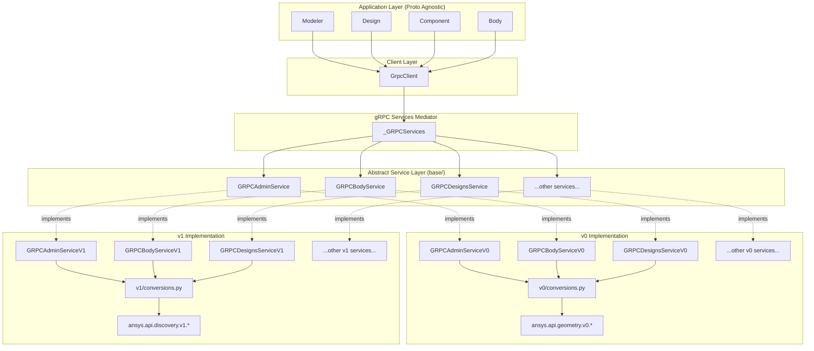
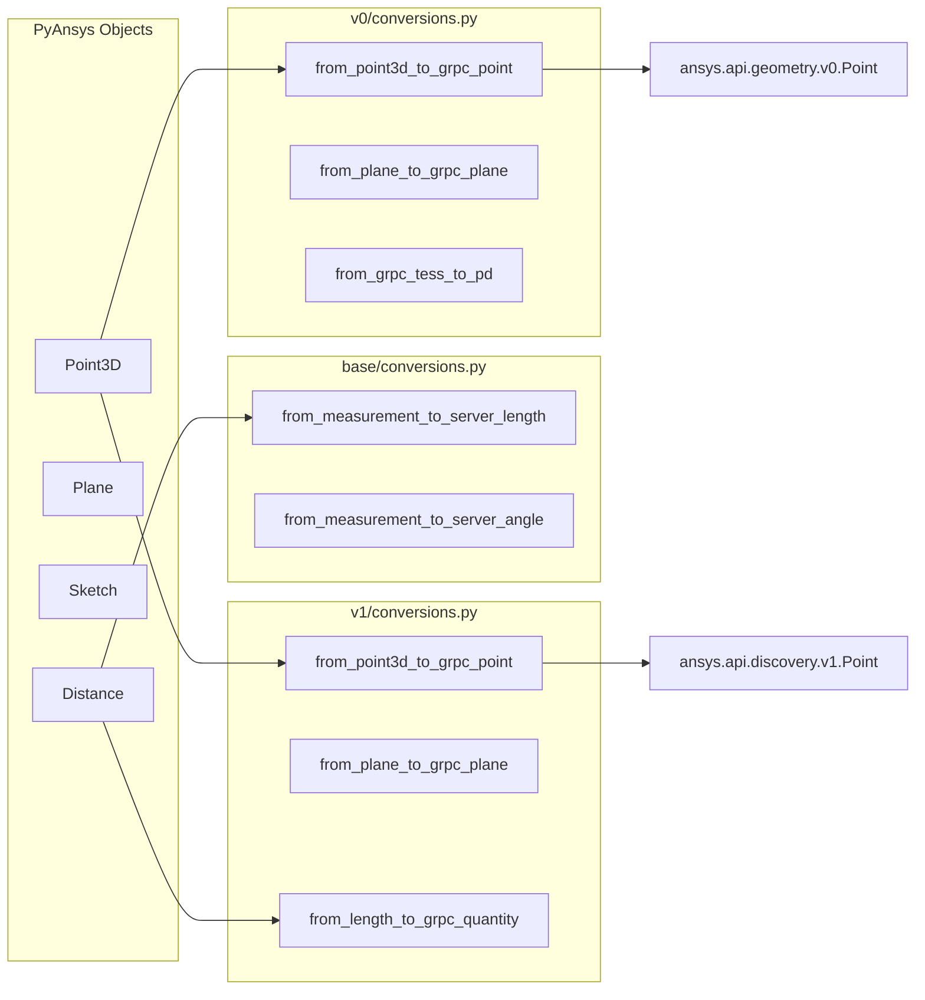
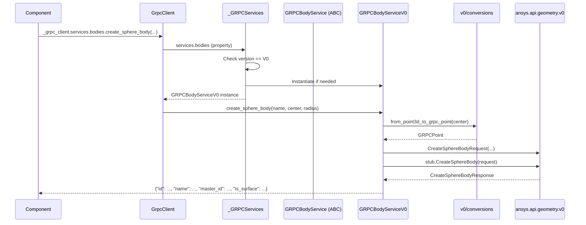

# gRPC Layer Architecture

## Overview

The gRPC layer in `ansys-geometry-core` provides a clean abstraction between the high-level Python API and the underlying Protobuf-based communication with Ansys Geometry backends (GeometryService, Discovery, SpaceClaim). This architecture enables **proto version agnosticism** for application layers while supporting multiple gRPC API versions (v0, v1) through a mediator pattern.

## Architecture Diagram



## Key Design Principles

| Principle | Implementation |
|-----------|----------------|
| **Version Agnosticism** | Application layers interact only with abstract service interfaces |
| **Mediator Pattern** | `_GRPCServices` routes calls to version-specific implementations |
| **Lazy Loading** | Services are instantiated on first access, not at initialization |
| **Dictionary Returns** | All service methods return Python dicts, not proto objects |

---

## Component Details

### 1. The Services Mediator (`_GRPCServices`)

**Location**: [src/ansys/geometry/core/_grpc/_services/_service.py](../../src/ansys/geometry/core/_grpc/_services/_service.py)

The `_GRPCServices` class acts as a **mediator/factory** that:

1. Detects or accepts the proto version to use
2. Lazy-loads the appropriate service implementation on first access
3. Provides a unified interface to all gRPC services

```python
class _GRPCServices:
    def __init__(self, channel: grpc.Channel, version: GeometryApiProtos | str | None = None):
        # Set the proto version to be used
        self.version = set_proto_version(channel, version)
        self.channel = channel
        
        # Lazy load all the services
        self._bodies = None
        self._designs = None
        # ... other services
    
    @property
    def bodies(self) -> GRPCBodyService:
        if not self._bodies:
            if self.version == GeometryApiProtos.V0:
                self._bodies = GRPCBodyServiceV0(self.channel)
            elif self.version == GeometryApiProtos.V1:
                self._bodies = GRPCBodyServiceV1(self.channel)
        return self._bodies
```

**Benefit**: Upper layers call `client.services.bodies.create_sphere_body(...)` without knowing which proto version is active.

---

### 2. Abstract Service Layer (`base/`)

**Location**: [src/ansys/geometry/core/_grpc/_services/base/](../../src/ansys/geometry/core/_grpc/_services/base/)

Each service has an abstract base class defining the contract:

```python
class GRPCBodyService(ABC):
    """Body service for gRPC communication with the Geometry server."""

    @abstractmethod
    def create_sphere_body(self, **kwargs) -> dict:
        """Create a sphere body."""
        pass

    @abstractmethod
    def create_extruded_body(self, **kwargs) -> dict:
        """Create an extruded body."""
        pass
    
    # ... other abstract methods
```

**Key characteristics**:

- Methods accept `**kwargs` for flexibility across versions
- Return type is always `dict` (not proto messages)
- No proto imports at this level

**Available services**:

| Service | Purpose |
|---------|---------|
| `GRPCAdminService` | Server health, backend info |
| `GRPCBodyService` | Body creation/manipulation |
| `GRPCDesignsService` | Design lifecycle (create, open, save) |
| `GRPCComponentsService` | Component hierarchy management |
| `GRPCFacesService` | Face queries and operations |
| `GRPCEdgesService` | Edge queries and operations |
| `GRPCMaterialsService` | Material assignment |
| `GRPCMeasurementToolsService` | Measurement operations |
| `GRPCRepairToolsService` | Geometry repair operations |
| `GRPCPrepareToolsService` | Geometry preparation operations |

---

### 3. Version-Specific Implementations (`v0/`, `v1/`)

**Locations**:
- [src/ansys/geometry/core/_grpc/_services/v0/](../../src/ansys/geometry/core/_grpc/_services/v0/)
- [src/ansys/geometry/core/_grpc/_services/v1/](../../src/ansys/geometry/core/_grpc/_services/v1/)

Each version folder contains:

```
v0/
├── admin.py           # GRPCAdminServiceV0
├── bodies.py          # GRPCBodyServiceV0
├── designs.py         # GRPCDesignsServiceV0
├── conversions.py     # v0-specific type conversions
└── ... (other services)
```

#### Implementation Pattern

```python
class GRPCBodyServiceV0(GRPCBodyService):
    """Body service for v0 of the Geometry API."""

    @protect_grpc
    def __init__(self, channel: grpc.Channel):
        # Import v0-specific stubs
        from ansys.api.geometry.v0.bodies_pb2_grpc import BodiesStub
        self.stub = BodiesStub(channel)

    @protect_grpc
    def create_sphere_body(self, **kwargs) -> dict:
        # Import v0-specific proto messages
        from ansys.api.geometry.v0.bodies_pb2 import CreateSphereBodyRequest
        
        # Build request using v0 conversions
        request = CreateSphereBodyRequest(
            name=kwargs["name"],
            center=from_point3d_to_grpc_point(kwargs["center"]),
            radius=from_measurement_to_server_length(kwargs["radius"]),
        )
        
        # Call gRPC
        resp = self.stub.CreateSphereBody(request=request)
        
        # Return normalized dictionary
        return {
            "id": resp.id,
            "name": resp.name,
            "master_id": resp.master_id,
            "is_surface": resp.is_surface,
        }
```

**Key pattern**: 
- Import proto types inside methods (lazy import)
- Use version-specific conversion helpers
- Return plain Python dictionaries

---

### 4. Conversion Modules

Each version has its own conversion module handling the translation between PyAnsys Geometry objects and proto messages.



**Common conversions** (`base/conversions.py`):
- `from_measurement_to_server_length()` - Unit conversion to server length
- `from_measurement_to_server_angle()` - Unit conversion to server angle
- `to_distance()` - Server value to Distance object

**Version-specific conversions** (e.g., `v0/conversions.py`):
- `from_point3d_to_grpc_point()` - Point3D to proto Point
- `from_plane_to_grpc_plane()` - Plane to proto Plane
- `from_grpc_tess_to_pd()` - Proto tessellation to PyVista mesh
- `build_grpc_id()` - Build entity identifiers

---

### 5. Version Detection (`_version.py`)

**Location**: [src/ansys/geometry/core/_grpc/_version.py](../../src/ansys/geometry/core/_grpc/_version.py)

```python
@unique
class GeometryApiProtos(Enum):
    """Enumeration of the supported versions of the gRPC API protocol."""
    V0 = 0, V0HealthStub, V0HealthRequest
    V1 = 1, V1HealthStub, V1HealthRequest

    def verify_supported(self, channel: grpc.Channel) -> bool:
        """Check if the server supports this version."""
        StubClass = self.value[1]
        RequestClass = self.value[2]
        try:
            admin_stub = StubClass(channel)
            admin_stub.Health(RequestClass())
            return True
        except grpc.RpcError:
            return False
```

The `set_proto_version()` function:
1. Accepts explicit version or auto-detects
2. Verifies server compatibility
3. Returns the active `GeometryApiProtos` enum

---

## Data Flow: Creating a Sphere



---

## Proto Package Differences

| Aspect | v0 | v1 |
|--------|----|----|
| **Package** | `ansys.api.geometry.v0` | `ansys.api.discovery.v1` |
| **ID fields** | String `id` | `EntityIdentifier.id` |
| **Measurements** | Raw floats (meters) | `Quantity` messages with units |
| **Request pattern** | Single request | Often uses `RequestData` wrappers |
| **Response pattern** | Direct fields | Often uses repeated fields |

### Example: ID Handling

```python
# v0: Simple string
return {"id": resp.id}

# v1: Nested identifier  
return {"id": resp.bodies[0].id.id}
```

### Example: Distance Handling

```python
# v0: Convert to raw float
radius=from_measurement_to_server_length(kwargs["radius"])

# v1: Build Quantity message
radius=from_length_to_grpc_quantity(kwargs["radius"])
```

---

## Adding a New Proto Version

To add support for a new proto version (e.g., v2):

1. **Create version folder**: `_grpc/_services/v2/`

2. **Implement services**: Create `bodies.py`, `designs.py`, etc. inheriting from base classes

3. **Add conversions**: Create `v2/conversions.py` with version-specific helpers

4. **Register in enum**: Update `GeometryApiProtos` in `_version.py`:
   ```python
   V2 = 2, V2HealthStub, V2HealthRequest
   ```

5. **Update mediator**: Add version branch in each `_GRPCServices` property:
   ```python
   elif self.version == GeometryApiProtos.V2:
       self._bodies = GRPCBodyServiceV2(self.channel)
   ```

---

## Benefits of This Architecture

| Benefit | Description |
|---------|-------------|
| **Isolation** | Proto changes don't affect application code |
| **Testability** | Can mock services at the abstract level |
| **Maintainability** | Each version is self-contained |
| **Backward Compatibility** | Old servers work with old proto version |
| **Forward Compatibility** | New versions can be added without breaking existing code |
| **Performance** | Lazy loading reduces startup overhead |

---

## Related Documentation

- [Connection Module](./connection-module.md) - Backend connection management
- [Designer Module](./designer-module.md) - High-level design API
- [Error Handling](./error-handling.md) - gRPC error protection patterns
